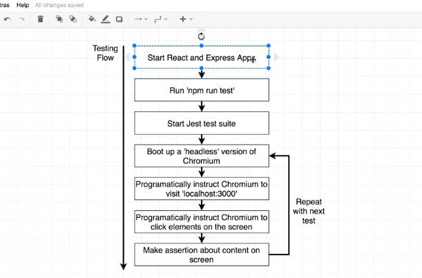
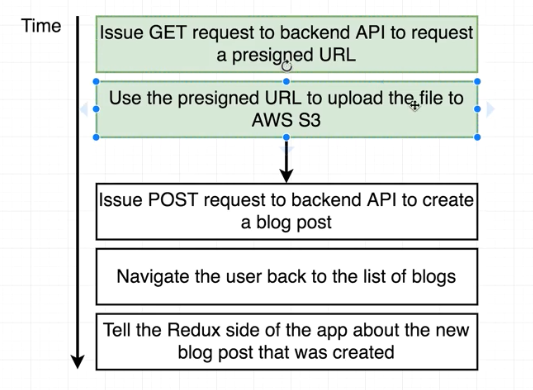

# AdvancedNodeStarter
Starting project for a course on Advanced Node @ Udemy

This is blog post application based on node.js, mongodb, redis

To cache data in redis all we need to do is chain cache(hashKey) method to mongoose model invocation.
This causes redis caching of data for 10 sec.
To flush cache we need to add cleanCache function to route handler middleware.

# Usage
To start development run
npm start dev

# Testing
npm start test

# CI
Travis is used for ci tests

# Files Upload

